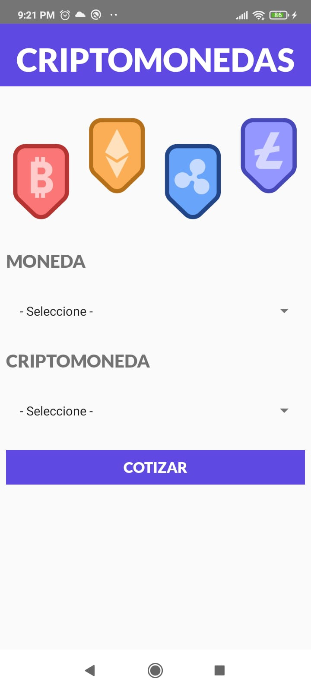
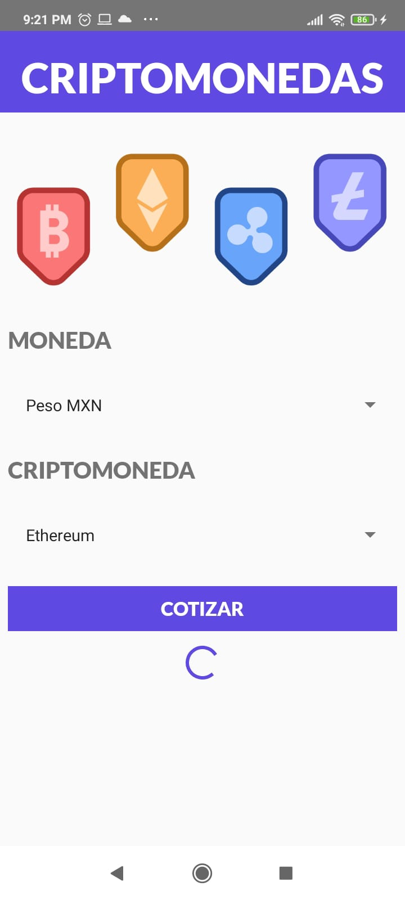
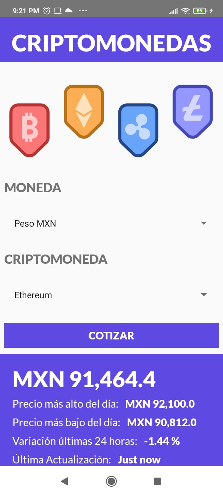

## 🚀 Cotizador de Criptomonedas

1.  **App creada del curso de react native de Juan Pablo De la torre Valdez.**

En esta app se aprendio a consumir apis externar, haciendo peticiones GET y mostrando los resultados en pantalla.

